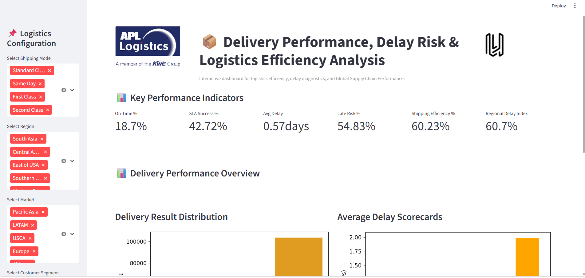
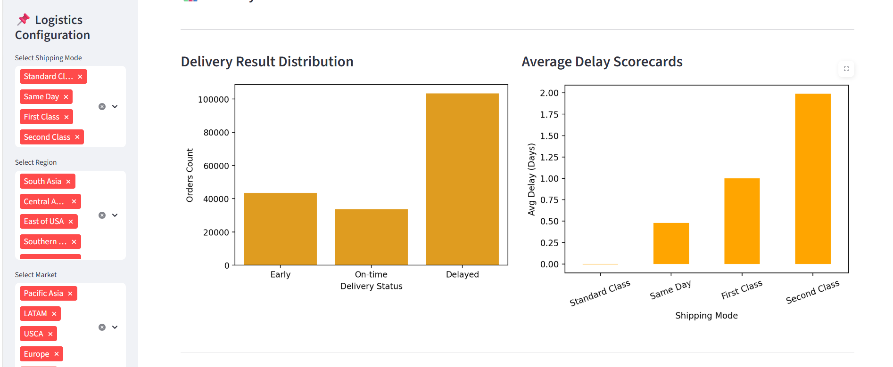
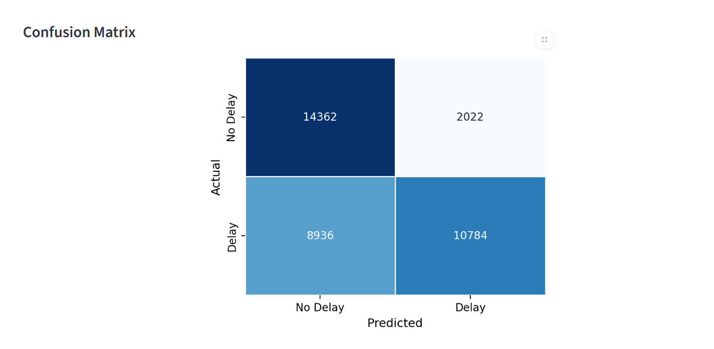
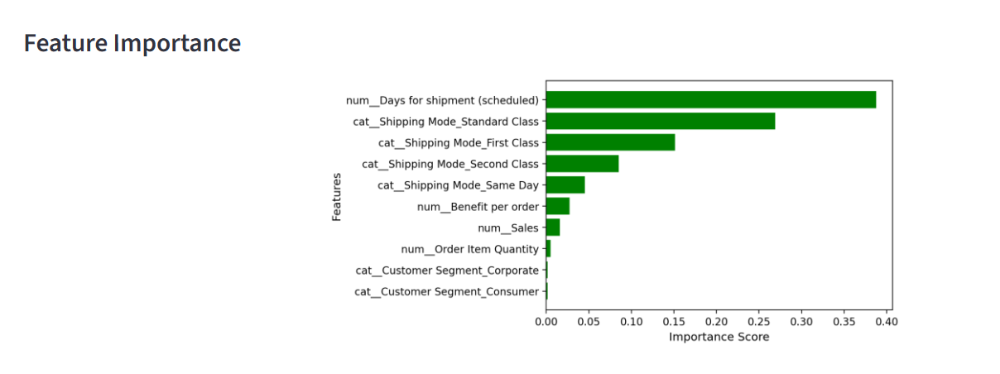

# 🚚 Delivery Performance, Delay Risk, and Logistics Efficiency Analysis in Global Supply Chain Operations

## 📌 Project Overview

This project is an end-to-end Data Analytics and Machine Learning solution developed to analyze global supply chain operations, identify logistics inefficiencies, and predict late delivery risks.  

An interactive Streamlit dashboard was built to visualize delivery performance, shipping mode effectiveness, regional bottlenecks, market efficiency, and predictive insights for business decision-making.

---
 
#  📸 Dashboard Preview

---

# ❗ Problem Statement

Global supply chain operations often face:

- Late deliveries  
- Poor shipment planning  
- Regional logistics inefficiencies  
- Inconsistent shipping mode performance  
- Difficulty identifying delay risks in advance  

Businesses need a data-driven system to monitor performance and proactively reduce delays.

---

# 🎯 Objectives

- Analyze delivery performance across regions and markets  
- Identify high-risk shipping modes and delay-prone zones  
- Measure logistics efficiency using operational KPIs  
- Build a machine learning model to predict late delivery risk  
- Develop an interactive dashboard for business monitoring  

---

# 📂 Dataset Description

The dataset contains supply chain operational records including:

- Dataset contains global supply chain transaction records.
- Includes shipping, sales, profit, region, and customer data.
- Contains operational and delivery-related variables.
- Used for analytics and predictive modeling.

Important Columns

- Shipping Mode  
- Order Region  
- Market  
- Customer Segment  
- Sales  
- Order Quantity  
- Benefit per Order  
- Discount  
- Product Price  
- Scheduled Shipping Days  
- Late Delivery Risk  

The data represents global logistics transactions across multiple markets and regions.

---

# 📊 Exploratory Data Analysis (EDA)

EDA was performed to understand operational patterns and hidden trends.

### Analysis Performed:

- Checked dataset structure and null values.
- Analyzed delivery result distribution.
- Calculated delay gap trends.
- Compared shipping mode performance.
- Performed region-wise delay analysis.
- Evaluated market logistics efficiency.
- Built KPI metrics.

---

# 🔍 Major Insights

- Standard Class shipments showed higher delay frequency.
- Certain regions recorded higher average delay gaps.  
- Some markets operated with better logistics efficiency.  
- Shipping mode strongly influenced delivery performance.  
- Late delivery risks can be predicted using operational features. 

---

# 🧠 Feature Selection

The following features were selected for model training:

- Shipping Mode
- Order Region
- Market
- Customer Segment
- Type
- Days for shipment (scheduled)
- Order Item Quantity
- Sales
- Benefit per order
- Order Item Discount
- Order Item Product Price

Target Variable: 
- Late_delivery_risk

---

# 🤖 Machine Learning Model 

Multiple ML approaches were evaluated, and Random Forest classifier was selected as the final model based on balanced performance and interpretability.

Why Random Forest?

- Handles mixed data types efficiently
- Reduces overfitting using ensemble learning
- Works well on tabular business datasets
- Provides feature importance analysis

---

# 📈 Evaluation Metrics

Model performance was evaluated using:
- Accuracy
- Precision
- Recall
- F1 Score
- Confusion Matrix
- ROC-AUC Score

---

# 🖥️ Streamlit Dashboard Modules

The project includes an interactive dashboard with the following modules:

- Overview Dashboard
- Delay Risk Analysis
- Shipping Mode Comparison
- Regional & Market Diagnostics
- Prediction Module
- Model Insights

---

# ✨ Key UI Features

- Interactive Filters
- KPI Cards
- Clean Visual Layout
- Centered Graph Design
- Responsive Dashboard
- Confusion matrix
- Feature importance
- Real-time Prediction Module

---

# ⚙️ Tech Stack

- Python
- Pandas
- Numpy
- Matplotlib
- Seaborn
- Scikit-learn
- Joblib
- Streamlit

---

# 📁 Project Structure

SupplyChainProject/
│── app.py
│── apl_analysis.ipynb
│── APL_Logistics.csv
│── late_delivery_model.pkl
│── requirements.txt
│── README.md
│── images/
│    ├── APL_dashboard.png
│    ├── APL_dashboard_1.png
│    ├── Confusion_matrix.png
│    ├── Delay_risk.png
│    └── Feature_importance.png

---

# ✅ Result & Conclusion

The project successfully transformed raw supply chain data into actionable business insights.

Key achievements:
- Identified delay-prone shipping operations
- Improved visibility into regional performance
- Built predictive model for proactive risk management
- Delivered executive-level interactive dashboard

This solution can support better logistics planning and operational efficiency.

---

# 🚀 Future Improvements

- Deploy to AWS/Google/Azure Cloud
- Real-time API integration
- Advanced models(CatBoost)
- Shipment tracking integration
- Cost optimization analytics
- Automated alerts for risky orders

---

# 👨‍💻 Developed By

Jayanthi Varri

🔗 LinkedIn:https://www.linkedin.com/in/jayanthi-varri
